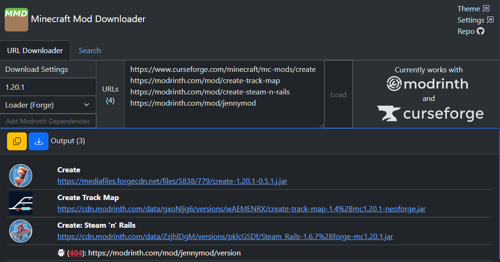
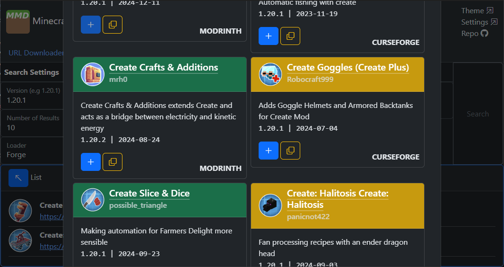
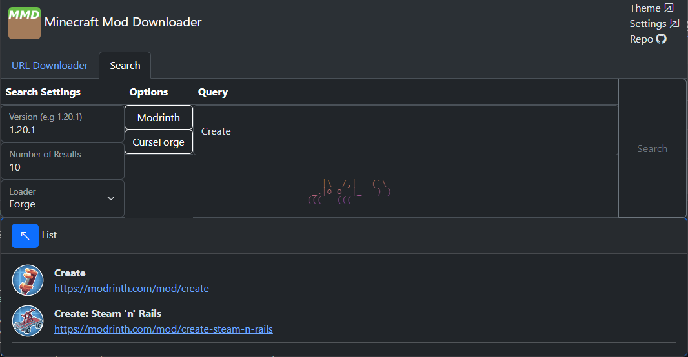

## MinecraftModDownloader
This application is a robust/feature-rich Minecraft mod downloader and searcher. It currently works for Java mods hosted on Modrinth and Curseforge.

> [Live Demo (Nigtly) ](https://thehousewashere.github.io/MinecraftModDownloader/)
| Recommended Browser: Firefox

> [Releases](https://github.com/thehousewashere/MinecraftModDownloader/releases) 

